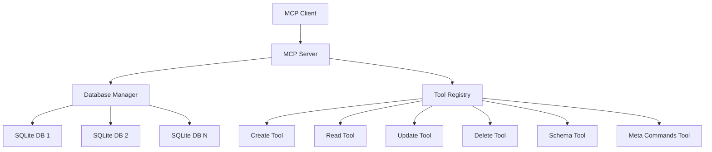

# Design Document

## Overview

SQLite CRUD 기능을 제공하는 MCP(Model Context Protocol) 서버를 TypeScript로 구현합니다. 이 서버는 각 API 호출마다 데이터베이스 경로를 파라미터로 받아 다양한 SQLite 데이터베이스 파일에 대해 CRUD 작업을 수행할 수 있습니다. MCP 프로토콜을 통해 표준화된 방식으로 클라이언트와 통신하며, better-sqlite3 라이브러리를 사용하여 고성능 SQLite 작업을 제공합니다.

## Architecture

### 전체 아키텍처



### 레이어 구조

1. **MCP Protocol Layer**: MCP 프로토콜 처리 및 클라이언트 통신
2. **Tool Layer**: 각 CRUD 작업을 담당하는 도구들
3. **Database Manager Layer**: 데이터베이스 연결 관리 및 쿼리 실행
4. **SQLite Layer**: better-sqlite3를 통한 실제 데이터베이스 작업

## Components and Interfaces

### 1. MCP Server Component

```typescript
interface MCPServerConfig {
  name: string;
  version: string;
  capabilities: {
    tools: { listChanged: boolean };
  };
}
```

### 2. Database Manager Component

```typescript
interface DatabaseManager {
  getDatabase(path: string): Database;
  closeDatabase(path: string): void;
  closeAllDatabases(): void;
  executeQuery(path: string, sql: string, params?: any[]): QueryResult;
  executeTransaction(path: string, operations: Operation[]): TransactionResult;
}

interface Database {
  path: string;
  connection: BetterSQLite3Database;
  lastAccessed: Date;
}
```

### 3. Tool Interfaces

```typescript
interface ToolDefinition {
  name: string;
  description: string;
  inputSchema: ZodSchema;
  outputSchema: ZodSchema;
  handler: ToolHandler;
}

interface ToolHandler {
  (params: any): Promise<ToolResult>;
}

interface ToolResult {
  content: Array<{ type: 'text'; text: string }>;
  structuredContent?: any;
}
```

### 4. Query Result Types

```typescript
interface QueryResult {
  success: boolean;
  data?: any[];
  rowsAffected?: number;
  lastInsertRowid?: number;
  error?: string;
}

interface TransactionResult {
  success: boolean;
  results: QueryResult[];
  error?: string;
}
```

## Data Models

### 1. Tool Input Schemas

```typescript
// Create Operations
const CreateTableSchema = z.object({
  dbPath: z.string().describe('SQLite 데이터베이스 파일 경로'),
  tableName: z.string().describe('생성할 테이블 이름'),
  columns: z.array(z.object({
    name: z.string(),
    type: z.string(),
    constraints: z.string().optional()
  })).describe('테이블 컬럼 정의')
});

const InsertDataSchema = z.object({
  dbPath: z.string().describe('SQLite 데이터베이스 파일 경로'),
  tableName: z.string().describe('데이터를 삽입할 테이블 이름'),
  data: z.record(z.any()).describe('삽입할 데이터 객체')
});

// Read Operations
const SelectDataSchema = z.object({
  dbPath: z.string().describe('SQLite 데이터베이스 파일 경로'),
  query: z.string().describe('실행할 SELECT SQL 쿼리'),
  params: z.array(z.any()).optional().describe('쿼리 파라미터')
});

// Update Operations
const UpdateDataSchema = z.object({
  dbPath: z.string().describe('SQLite 데이터베이스 파일 경로'),
  query: z.string().describe('실행할 UPDATE SQL 쿼리'),
  params: z.array(z.any()).optional().describe('쿼리 파라미터')
});

// Delete Operations
const DeleteDataSchema = z.object({
  dbPath: z.string().describe('SQLite 데이터베이스 파일 경로'),
  query: z.string().describe('실행할 DELETE SQL 쿼리'),
  params: z.array(z.any()).optional().describe('쿼리 파라미터')
});

// Schema Operations
const GetSchemaSchema = z.object({
  dbPath: z.string().describe('SQLite 데이터베이스 파일 경로'),
  tableName: z.string().optional().describe('특정 테이블의 스키마 (선택사항)')
});

// Meta Commands
const MetaCommandSchema = z.object({
  dbPath: z.string().describe('SQLite 데이터베이스 파일 경로'),
  command: z.enum(['.tables', '.schema', '.indexes', '.pragma']).describe('실행할 메타 명령'),
  target: z.string().optional().describe('명령 대상 (테이블명 등)')
});
```

### 2. Tool Output Schemas

```typescript
const QueryResultSchema = z.object({
  success: z.boolean(),
  data: z.array(z.record(z.any())).optional(),
  rowsAffected: z.number().optional(),
  lastInsertRowid: z.number().optional(),
  error: z.string().optional()
});

const SchemaResultSchema = z.object({
  success: z.boolean(),
  tables: z.array(z.string()).optional(),
  schema: z.string().optional(),
  columns: z.array(z.object({
    name: z.string(),
    type: z.string(),
    notnull: z.boolean(),
    dflt_value: z.any(),
    pk: z.boolean()
  })).optional(),
  error: z.string().optional()
});
```

## Correctness Properties

*A property is a characteristic or behavior that should hold true across all valid executions of a system-essentially, a formal statement about what the system should do. Properties serve as the bridge between human-readable specifications and machine-verifiable correctness guarantees.*

### Property Reflection

여러 속성들을 검토한 결과, 일부 중복되는 속성들을 통합하여 더 포괄적인 속성으로 만들 수 있습니다:

- 데이터베이스 연결 관련 속성들 (1.1, 1.2, 1.3)은 데이터베이스 연결 처리 속성으로 통합
- CRUD 작업 결과 반환 속성들 (2.4, 4.2, 5.2)은 각각의 작업 속성에 포함
- 오류 처리 속성들 (2.3, 4.4, 8.3)은 일반적인 오류 처리 속성으로 통합
- 빈 결과 처리 속성들 (3.4, 6.4)은 각각의 조회 속성에 포함

### Core Properties

Property 1: 데이터베이스 연결 처리
*For any* 데이터베이스 경로에 대해, 유효한 경로는 성공적으로 연결되고, 잘못된 경로는 적절한 오류를 반환하며, 존재하지 않는 파일은 새로 생성되어야 한다
**Validates: Requirements 1.1, 1.2, 1.3**

Property 2: 동시 데이터베이스 처리
*For any* 여러 데이터베이스 경로 요청에 대해, 각각은 독립적으로 처리되어야 하며 서로 간섭하지 않아야 한다
**Validates: Requirements 1.4**

Property 3: 테이블 생성 일관성
*For any* 유효한 테이블 스키마에 대해, 테이블 생성 요청은 지정된 스키마대로 테이블을 생성해야 한다
**Validates: Requirements 2.1**

Property 4: 데이터 삽입 라운드트립
*For any* 유효한 데이터에 대해, 데이터를 삽입한 후 조회하면 동일한 데이터가 반환되어야 하며, 삽입된 행의 ID가 반환되어야 한다
**Validates: Requirements 2.2, 2.4**

Property 5: SELECT 쿼리 결과 형식
*For any* 유효한 SELECT 쿼리에 대해, 결과는 JSON 형태로 반환되어야 하며, WHERE 절이 있는 경우 올바르게 필터링되어야 한다
**Validates: Requirements 3.1, 3.2**

Property 6: UPDATE 작업 정확성
*For any* 유효한 UPDATE 쿼리에 대해, 지정된 조건에 맞는 행들이 업데이트되고 영향받은 행의 수가 정확히 반환되어야 한다
**Validates: Requirements 4.1, 4.2**

Property 7: DELETE 작업 정확성
*For any* 유효한 DELETE 쿼리에 대해, 지정된 조건에 맞는 행들이 삭제되고 삭제된 행의 수가 정확히 반환되어야 한다
**Validates: Requirements 5.1, 5.2**

Property 8: 스키마 정보 정확성
*For any* 데이터베이스에 대해, 테이블 목록과 스키마 정보 요청은 정확한 정보를 반환해야 한다
**Validates: Requirements 6.1, 6.2**

Property 9: 메타 명령 실행
*For any* SQLite 메타 명령(.tables, .schema, .indexes, .pragma)에 대해, 올바른 정보가 반환되어야 한다
**Validates: Requirements 7.1, 7.2, 7.3, 7.4, 7.5**

Property 10: MCP 프로토콜 준수
*For any* MCP 클라이언트 연결에 대해, 표준 MCP 핸드셰이크가 수행되고 모든 CRUD 도구가 노출되어야 한다
**Validates: Requirements 8.1, 8.2, 8.4**

Property 11: 오류 처리 일관성
*For any* 잘못된 입력(SQL 구문, 컬럼명, 테이블명, MCP 메시지)에 대해, 적절한 오류 메시지가 반환되어야 한다
**Validates: Requirements 2.3, 3.3, 4.4, 6.3, 8.3**

## Error Handling

### 1. Database Connection Errors

```typescript
enum DatabaseErrorType {
  INVALID_PATH = 'INVALID_PATH',
  PERMISSION_DENIED = 'PERMISSION_DENIED',
  DISK_FULL = 'DISK_FULL',
  CORRUPTED_DATABASE = 'CORRUPTED_DATABASE'
}

interface DatabaseError {
  type: DatabaseErrorType;
  message: string;
  path: string;
  originalError?: Error;
}
```

### 2. SQL Execution Errors

```typescript
enum SQLErrorType {
  SYNTAX_ERROR = 'SYNTAX_ERROR',
  TABLE_NOT_EXISTS = 'TABLE_NOT_EXISTS',
  COLUMN_NOT_EXISTS = 'COLUMN_NOT_EXISTS',
  CONSTRAINT_VIOLATION = 'CONSTRAINT_VIOLATION',
  TYPE_MISMATCH = 'TYPE_MISMATCH'
}

interface SQLError {
  type: SQLErrorType;
  message: string;
  query: string;
  position?: number;
}
```

### 3. MCP Protocol Errors

```typescript
enum MCPErrorType {
  INVALID_REQUEST = 'INVALID_REQUEST',
  TOOL_NOT_FOUND = 'TOOL_NOT_FOUND',
  INVALID_PARAMETERS = 'INVALID_PARAMETERS',
  INTERNAL_ERROR = 'INTERNAL_ERROR'
}

interface MCPError {
  type: MCPErrorType;
  message: string;
  code: number;
  data?: any;
}
```

### 4. Error Handling Strategy

- **Graceful Degradation**: 하나의 데이터베이스 연결 실패가 다른 연결에 영향을 주지 않음
- **Detailed Error Messages**: 사용자가 문제를 이해하고 해결할 수 있도록 구체적인 오류 정보 제공
- **Error Logging**: 모든 오류를 로그에 기록하여 디버깅 지원
- **Resource Cleanup**: 오류 발생 시 적절한 리소스 정리

## Testing Strategy

### 1. Unit Testing

**Framework**: Jest를 사용하여 개별 컴포넌트 테스트

**Coverage Areas**:
- Database Manager의 연결 관리 기능
- 각 Tool의 입력 검증 및 출력 형식
- Error Handler의 오류 분류 및 메시지 생성
- SQL 쿼리 빌더 함수들

**Example Unit Tests**:
```typescript
describe('DatabaseManager', () => {
  test('should create new database file when path does not exist', () => {
    // Test specific example of database creation
  });

  test('should return error for invalid file permissions', () => {
    // Test specific error condition
  });
});
```

### 2. Property-Based Testing

**Framework**: fast-check를 사용하여 속성 기반 테스트 구현

**Configuration**: 각 속성 테스트는 최소 100회 반복 실행

**Property Test Requirements**:
- 각 correctness property는 단일 속성 기반 테스트로 구현
- 각 테스트는 설계 문서의 속성을 명시적으로 참조
- 테스트 태그 형식: `**Feature: sqlite-mcp-server, Property {number}: {property_text}**`

**Example Property Tests**:
```typescript
describe('Property Tests', () => {
  test('**Feature: sqlite-mcp-server, Property 4: 데이터 삽입 라운드트립**', () => {
    fc.assert(fc.property(
      fc.record({
        tableName: fc.string(),
        data: fc.record({ id: fc.integer(), name: fc.string() })
      }),
      (testCase) => {
        // Insert data and verify round-trip consistency
      }
    ), { numRuns: 100 });
  });
});
```

### 3. Integration Testing

**Scope**: MCP 프로토콜 전체 플로우 테스트
- 클라이언트-서버 통신
- 실제 SQLite 파일 작업
- 동시성 처리

### 4. Test Data Generation

**Smart Generators**:
- 유효한 SQL 구문 생성기
- 다양한 데이터 타입 조합 생성기
- 유효/무효 파일 경로 생성기
- MCP 메시지 형식 생성기

### 5. Test Environment

**Database Isolation**: 각 테스트는 독립적인 임시 데이터베이스 사용
**Cleanup Strategy**: 테스트 완료 후 임시 파일 자동 정리
**Parallel Execution**: 테스트 간 격리를 통한 병렬 실행 지원

## Implementation Notes

### 1. Performance Considerations

- **Connection Pooling**: 자주 사용되는 데이터베이스 연결 캐싱
- **Prepared Statements**: SQL 쿼리 성능 최적화
- **Memory Management**: 대용량 결과 집합에 대한 스트리밍 처리

### 2. Security Considerations

- **Path Validation**: 디렉토리 트래버설 공격 방지
- **SQL Injection Prevention**: 매개변수화된 쿼리 사용 강제
- **Resource Limits**: 메모리 및 CPU 사용량 제한

### 3. Scalability Considerations

- **Concurrent Access**: 여러 클라이언트의 동시 접근 처리
- **Database Locking**: SQLite WAL 모드 활용
- **Error Recovery**: 연결 실패 시 자동 재시도 메커니즘

### 4. Monitoring and Logging

- **Query Performance**: 느린 쿼리 감지 및 로깅
- **Error Tracking**: 오류 발생 패턴 분석
- **Usage Metrics**: API 사용량 및 성능 지표 수집